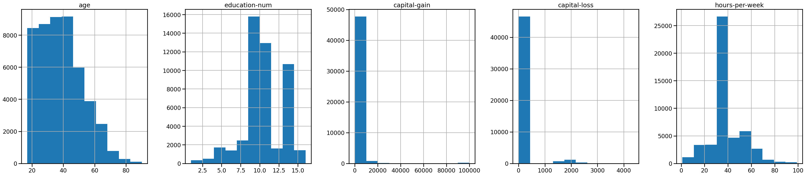
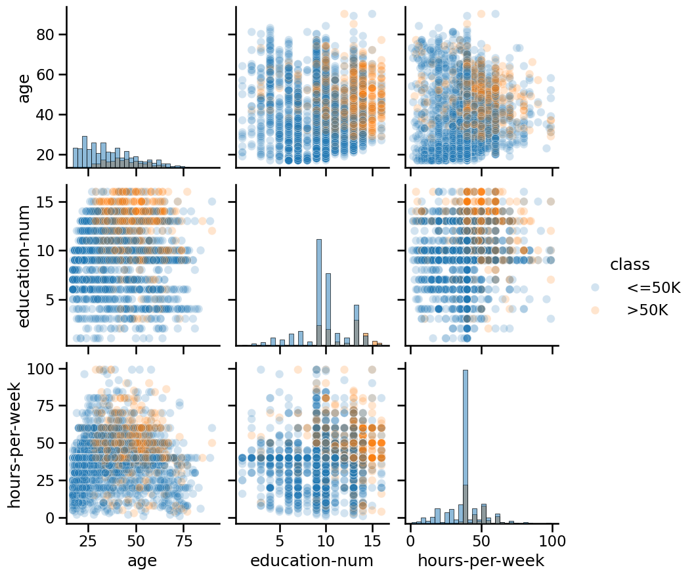

class: titlepage

.header[MOOC Machine learning with scikit-learn]

# Tabular data exploration


---
# First look at your dataset

- Inspect your dataset before any machine learning model

- Differentiate between numerical and categorical variables

- Visualize distributions of variables

---
# Loading a dataset

<div style="font-size:32px">
We will load the adult census dataset, a collection of demographic
information for the adult population as of 1994 in the USA:
</div>

```python
import pandas as pd

adult_census = pd.read_csv("../datasets/adult-census.csv")

adult_census.head()
```

<div>
<style scoped>
    .dataframe {
        font-size: 11px;
        max-width: 100%;
        border-collapse: collapse;
    }
    .dataframe th, .dataframe td {
        padding: 2px 6px;
        border: 1px solid #ccc;
    }
    .dataframe thead th {
        text-align: right;
    }
    .dataframe tbody tr th, .dataframe tbody tr td {
        vertical-align: middle;
    }
    .dataframe {
        overflow-x: auto;
        display: block;
    }
</style>
<table border="1" class="dataframe">
  <thead>
    <tr style="text-align: right;">
      <th></th>
      <th>age</th>
      <th>workclass</th>
      <th>education</th>
      <th>education-num</th>
      <th>marital-status</th>
      <th>occupation</th>
      <th>relationship</th>
      <th>race</th>
      <th>sex</th>
      <th>capital-gain</th>
      <th>capital-loss</th>
      <th>hours-per-week</th>
      <th>native-country</th>
      <th>class</th>
    </tr>
  </thead>
  <tbody>
    <tr>
      <th>0</th>
      <td>25</td>
      <td>Private</td>
      <td>11th</td>
      <td>7</td>
      <td>Never-married</td>
      <td>Machine-op-inspct</td>
      <td>Own-child</td>
      <td>Black</td>
      <td>Male</td>
      <td>0</td>
      <td>0</td>
      <td>40</td>
      <td>United-States</td>
      <td>&lt;=50K</td>
    </tr>
    <tr>
      <th>1</th>
      <td>38</td>
      <td>Private</td>
      <td>HS-grad</td>
      <td>9</td>
      <td>Married-civ-spouse</td>
      <td>Farming-fishing</td>
      <td>Husband</td>
      <td>White</td>
      <td>Male</td>
      <td>0</td>
      <td>0</td>
      <td>50</td>
      <td>United-States</td>
      <td>&lt;=50K</td>
    </tr>
    <tr>
      <th>2</th>
      <td>28</td>
      <td>Local-gov</td>
      <td>Assoc-acdm</td>
      <td>12</td>
      <td>Married-civ-spouse</td>
      <td>Protective-serv</td>
      <td>Husband</td>
      <td>White</td>
      <td>Male</td>
      <td>0</td>
      <td>0</td>
      <td>40</td>
      <td>United-States</td>
      <td>&gt;50K</td>
    </tr>
    <tr>
      <th>3</th>
      <td>44</td>
      <td>Private</td>
      <td>Some-college</td>
      <td>10</td>
      <td>Married-civ-spouse</td>
      <td>Machine-op-inspct</td>
      <td>Husband</td>
      <td>Black</td>
      <td>Male</td>
      <td>7688</td>
      <td>0</td>
      <td>40</td>
      <td>United-States</td>
      <td>&gt;50K</td>
    </tr>
    <tr>
      <th>4</th>
      <td>18</td>
      <td>?</td>
      <td>Some-college</td>
      <td>10</td>
      <td>Never-married</td>
      <td>?</td>
      <td>Own-child</td>
      <td>White</td>
      <td>Female</td>
      <td>0</td>
      <td>0</td>
      <td>30</td>
      <td>United-States</td>
      <td>&lt;=50K</td>
    </tr>
  </tbody>
</table>
</div>

???

**Rows and columns**

* Each row in the dataframe represents a "sample". In the field of machine learning or
descriptive statistics, commonly used equivalent terms are "record",
"instance", or "observation".

* Each column represents a type of information that has been collected and is
called a "feature". In the field of machine learning and descriptive
statistics, commonly used equivalent terms are "variable", "attribute", or
"covariate".

---
# Identifying the target variable

Predict whether a person is earning a high or low revenue in USD/year:

```python
target_column = "class"
adult_census[target_column].unique()
```

```
array([' <=50K', ' >50K'], dtype=object)
```

- Our target variable is the column **class** with levels: `<=50K` (low-revenue) and `>50K` (high-revenue)

- Thus, the prediction problem is a binary classification problem

---
# Dataset shape

We can infer the number of samples and the number of features in a dataset from its shape:

```python
print(
    f"The dataset contains {adult_census.shape[0]} samples and "
    f"{adult_census.shape[1]} columns."
)
```

```
The dataset contains 48842 samples and 14 columns.
```

```python
print(f"The dataset contains {adult_census.shape[1] - 1} features.")
```

```
The dataset contains 13 features.
```

---
# Inspecting the data

Before building a predictive model, it is a good idea to look at the data:

- maybe the task you are trying to achieve can be solved without machine
  learning

- you need to check that the information you need for your task is actually
  present in the dataset

- inspecting the data is a good way to find peculiarities

???

Peculiarities can arise during data collection (for example, malfunctioning sensor or missing values), or from the way the data is processed afterwards (for example capped values).

---
# Numerical columns

Numerical columns take continuous values:

```python
numerical_columns = [
    "age",
    "education-num",
    "capital-gain",
    "capital-loss",
    "hours-per-week",
]
```

---
# Inspecting numerical columns

We can visualize the distribution of numerical columns with histograms:

```python
_ = adult_census.hist(figsize=(40, 8), layout=(1, 5))
```



???

We can already make a few comments about some of the variables:

* `"age"`: there are not that many points for `age > 70`. The dataset
  description does indicate that retired people have been filtered out
  (`hours-per-week > 0`);
* `"education-num"`: peak at 10 and 13. These are the number of years of education.
* `"hours-per-week"` peaks at 40, this was very likely the standard number of
  working hours at the time of the data collection;
* most values of `"capital-gain"` and `"capital-loss"` are close to zero.

---
# Categorical columns

Categorical columns take finite discrete values:

```python
categorical_columns = [
    "workclass",
    "education",
    "marital-status",
    "occupation",
    "relationship",
    "race",
    "sex",
    "native-country",
]
```

---
# Inspecting categorical columns

We can look at the unique values counts of categorical columns:

```python
adult_census[target_column].value_counts()
```

```
class
<=50K    37155
>50K     11687
Name: count, dtype: int64
```

- Class imbalance in the target is common in many datasets
- Needs special attention when building and evaluating a model

---
# Imbalance in the input data

```python
adult_census["sex"].value_counts()
```

```
sex
Male      32650
Female    16192
Name: count, dtype: int64
```

- Our dataset contains an imbalance between male/female samples (e.g., due to data collection procedure)

- Our dataset is not representative of the US population

- Training a model on this data can cause disproportionate prediction errors for under-represented groups

---
# Inspecting relationships between columns

We can cross-tabulate categorical columns to see how features are related:

```python
pd.crosstab(
    index=adult_census["education"], columns=adult_census["education-num"]
)
```

---
# Inspecting relationships between columns

<div>
<style scoped>
    .dataframe {
        font-size: 12px;
        max-width: 100%;
        border-collapse: collapse;
    }
    .dataframe th, .dataframe td {
        padding: 2px 6px;
        border: 1px solid #ccc;
    }
    .dataframe thead th {
        text-align: right;
    }
    .dataframe tbody tr th, .dataframe tbody tr td {
        vertical-align: middle;
    }
    .dataframe {
        overflow-x: auto;
        display: block;
    }
</style>
<table border="1" class="dataframe">
  <thead>
    <tr style="text-align: right;">
      <th>education-num</th>
      <th>1</th>
      <th>2</th>
      <th>3</th>
      <th>4</th>
      <th>5</th>
      <th>6</th>
      <th>7</th>
      <th>8</th>
      <th>9</th>
      <th>10</th>
      <th>11</th>
      <th>12</th>
      <th>13</th>
      <th>14</th>
      <th>15</th>
      <th>16</th>
    </tr>
    <tr>
      <th>education</th>
      <th></th>
      <th></th>
      <th></th>
      <th></th>
      <th></th>
      <th></th>
      <th></th>
      <th></th>
      <th></th>
      <th></th>
      <th></th>
      <th></th>
      <th></th>
      <th></th>
      <th></th>
      <th></th>
    </tr>
  </thead>
  <tbody>
    <tr>
      <th>10th</th>
      <td>0</td>
      <td>0</td>
      <td>0</td>
      <td>0</td>
      <td>0</td>
      <td>1389</td>
      <td>0</td>
      <td>0</td>
      <td>0</td>
      <td>0</td>
      <td>0</td>
      <td>0</td>
      <td>0</td>
      <td>0</td>
      <td>0</td>
      <td>0</td>
    </tr>
    <tr>
      <th>11th</th>
      <td>0</td>
      <td>0</td>
      <td>0</td>
      <td>0</td>
      <td>0</td>
      <td>0</td>
      <td>1812</td>
      <td>0</td>
      <td>0</td>
      <td>0</td>
      <td>0</td>
      <td>0</td>
      <td>0</td>
      <td>0</td>
      <td>0</td>
      <td>0</td>
    </tr>
    <tr>
      <th>12th</th>
      <td>0</td>
      <td>0</td>
      <td>0</td>
      <td>0</td>
      <td>0</td>
      <td>0</td>
      <td>0</td>
      <td>657</td>
      <td>0</td>
      <td>0</td>
      <td>0</td>
      <td>0</td>
      <td>0</td>
      <td>0</td>
      <td>0</td>
      <td>0</td>
    </tr>
    <tr>
      <th>1st-4th</th>
      <td>0</td>
      <td>247</td>
      <td>0</td>
      <td>0</td>
      <td>0</td>
      <td>0</td>
      <td>0</td>
      <td>0</td>
      <td>0</td>
      <td>0</td>
      <td>0</td>
      <td>0</td>
      <td>0</td>
      <td>0</td>
      <td>0</td>
      <td>0</td>
    </tr>
    <tr>
      <th>5th-6th</th>
      <td>0</td>
      <td>0</td>
      <td>509</td>
      <td>0</td>
      <td>0</td>
      <td>0</td>
      <td>0</td>
      <td>0</td>
      <td>0</td>
      <td>0</td>
      <td>0</td>
      <td>0</td>
      <td>0</td>
      <td>0</td>
      <td>0</td>
      <td>0</td>
    </tr>
    <tr>
      <th>7th-8th</th>
      <td>0</td>
      <td>0</td>
      <td>0</td>
      <td>955</td>
      <td>0</td>
      <td>0</td>
      <td>0</td>
      <td>0</td>
      <td>0</td>
      <td>0</td>
      <td>0</td>
      <td>0</td>
      <td>0</td>
      <td>0</td>
      <td>0</td>
      <td>0</td>
    </tr>
    <tr>
      <th>9th</th>
      <td>0</td>
      <td>0</td>
      <td>0</td>
      <td>0</td>
      <td>756</td>
      <td>0</td>
      <td>0</td>
      <td>0</td>
      <td>0</td>
      <td>0</td>
      <td>0</td>
      <td>0</td>
      <td>0</td>
      <td>0</td>
      <td>0</td>
      <td>0</td>
    </tr>
    <tr>
      <th>Assoc-acdm</th>
      <td>0</td>
      <td>0</td>
      <td>0</td>
      <td>0</td>
      <td>0</td>
      <td>0</td>
      <td>0</td>
      <td>0</td>
      <td>0</td>
      <td>0</td>
      <td>0</td>
      <td>1601</td>
      <td>0</td>
      <td>0</td>
      <td>0</td>
      <td>0</td>
    </tr>
    <tr>
      <th>Assoc-voc</th>
      <td>0</td>
      <td>0</td>
      <td>0</td>
      <td>0</td>
      <td>0</td>
      <td>0</td>
      <td>0</td>
      <td>0</td>
      <td>0</td>
      <td>0</td>
      <td>2061</td>
      <td>0</td>
      <td>0</td>
      <td>0</td>
      <td>0</td>
      <td>0</td>
    </tr>
    <tr>
      <th>Bachelors</th>
      <td>0</td>
      <td>0</td>
      <td>0</td>
      <td>0</td>
      <td>0</td>
      <td>0</td>
      <td>0</td>
      <td>0</td>
      <td>0</td>
      <td>0</td>
      <td>0</td>
      <td>0</td>
      <td>8025</td>
      <td>0</td>
      <td>0</td>
      <td>0</td>
    </tr>
    <tr>
      <th>Doctorate</th>
      <td>0</td>
      <td>0</td>
      <td>0</td>
      <td>0</td>
      <td>0</td>
      <td>0</td>
      <td>0</td>
      <td>0</td>
      <td>0</td>
      <td>0</td>
      <td>0</td>
      <td>0</td>
      <td>0</td>
      <td>0</td>
      <td>0</td>
      <td>594</td>
    </tr>
    <tr>
      <th>HS-grad</th>
      <td>0</td>
      <td>0</td>
      <td>0</td>
      <td>0</td>
      <td>0</td>
      <td>0</td>
      <td>0</td>
      <td>0</td>
      <td>15784</td>
      <td>0</td>
      <td>0</td>
      <td>0</td>
      <td>0</td>
      <td>0</td>
      <td>0</td>
      <td>0</td>
    </tr>
    <tr>
      <th>Masters</th>
      <td>0</td>
      <td>0</td>
      <td>0</td>
      <td>0</td>
      <td>0</td>
      <td>0</td>
      <td>0</td>
      <td>0</td>
      <td>0</td>
      <td>0</td>
      <td>0</td>
      <td>0</td>
      <td>0</td>
      <td>2657</td>
      <td>0</td>
      <td>0</td>
    </tr>
    <tr>
      <th>Preschool</th>
      <td>83</td>
      <td>0</td>
      <td>0</td>
      <td>0</td>
      <td>0</td>
      <td>0</td>
      <td>0</td>
      <td>0</td>
      <td>0</td>
      <td>0</td>
      <td>0</td>
      <td>0</td>
      <td>0</td>
      <td>0</td>
      <td>0</td>
      <td>0</td>
    </tr>
    <tr>
      <th>Prof-school</th>
      <td>0</td>
      <td>0</td>
      <td>0</td>
      <td>0</td>
      <td>0</td>
      <td>0</td>
      <td>0</td>
      <td>0</td>
      <td>0</td>
      <td>0</td>
      <td>0</td>
      <td>0</td>
      <td>0</td>
      <td>0</td>
      <td>834</td>
      <td>0</td>
    </tr>
    <tr>
      <th>Some-college</th>
      <td>0</td>
      <td>0</td>
      <td>0</td>
      <td>0</td>
      <td>0</td>
      <td>0</td>
      <td>0</td>
      <td>0</td>
      <td>0</td>
      <td>10878</td>
      <td>0</td>
      <td>0</td>
      <td>0</td>
      <td>0</td>
      <td>0</td>
      <td>0</td>
    </tr>
  </tbody>
</table>
</div>

???

- For every entry in `"education"`, there is only one single corresponding value in `"education-num"`

- This shows that `"education"` and `"education-num"` give you the same information

- Thus, we can remove `"education-num"` without losing information

- Having redundant (or highly correlated) columns can be a problem for machine learning algorithms

---
# Pair plots

We can visualize numerical columns separately for each target class to see how features and target are related: 

```python
import seaborn as sns

# We plot a subset of the data to keep the plot readable and make the plotting
# faster
n_samples_to_plot = 5000
columns = ["age", "education-num", "hours-per-week"]
_ = sns.pairplot(
    data=adult_census[:n_samples_to_plot],
    vars=columns,
    hue=target_column,
    plot_kws={"alpha": 0.2},
    height=3,
    diag_kind="hist",
    diag_kws={"bins": 30},
)
```

---
# Pair plots



???

- Plots along the diagonal show the distribution of individual variables for each `"class"`.

- The plots on the off-diagonal can reveal interesting interactions between variables.

---
# Take home messages

- It is important to differentiate between categorical and numerical variables

- You can inspect the data with `pandas` and `seaborn`

- Data inspection can:

    - allow you to decide whether using machine learning is appropriate for your data
    
    - highlight potential peculiarities in your data

???

We made important observations (which will be discussed later in more detail):

* if your target variable is imbalanced (e.g., you have more samples from one
  target category than another), you may need special techniques for training
  and evaluating your machine learning model;
* having redundant (or highly correlated) columns can be a problem for some
  machine learning algorithms;
